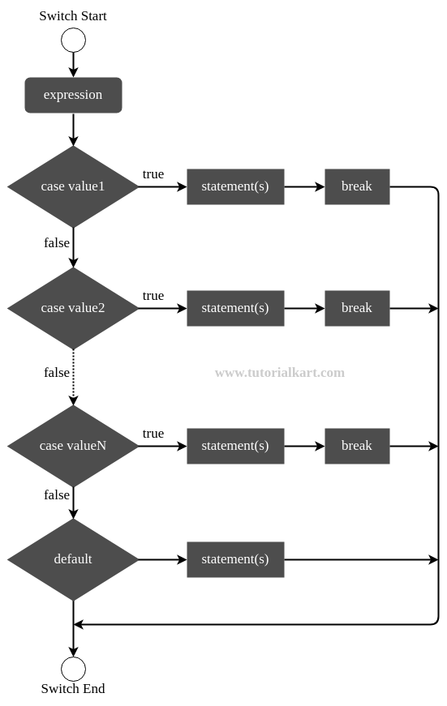

# C_plus_if

## Jak wysłać projekt na gitlab

```
#### Wykonaj w programie kotlin warunki oraz pętle napisane poniżej
```
**## 0.1 )ifFlochart)
w miejsce typu danych **int** , wstaw numer z dziennka .
zamiast zera wstaw dzień swoich urodzin.
użyj operatora <  lub >  który spełni warunek **if**
`int main() {
int a = 10;
if (a>0) {`


## 02 (ifFlochartB)

w miejsce typu danych **int** , wstaw numer z dziennka .
zamiast zera wstaw dzień swoich urodzin.
* jeśli warunek if się zgodzi , to program ma wyświetlić komunikat:
warunek if jest prawdziwy
* jeśli warunek if nie zgodzi się. Program ma wyświetlić komunikat:
warunek if jest błędny.** 

```    int a = -10;
    if (a>0) {
        cout << a << " is positive.";
    } else {
        cout << a << " is not positive."; `
```       


## 03 (switchFlochart)


```int main() 
{
int day = 25;
switch (day%7) {
case 1: {
cout << "Monday" << endl;
break;
}
case 2: {
cout << "Tuesday" << endl;
break;
}
case 3: {
```


Zatwierdz swoją pracę :
wykonaj: 
**branch** (ImieNazwisko)

wykonaj:
**commit 01** (nzwa zadania);
* commit 02 (nazwa zadania);
* commit 03 (nazwa zadania);
* commit 04 (nazwa zadania); 


04 (Wykonaj samodzielne zadanie, na podstawie schematu blokowego jak niżej)


 ### Narysuj schematy blokowe 
### w programie 
https://jamboard.google.com/d/1qF07n032vs2TLwMZvtyTzZBnK4U4IhCKX3ZyGvx44Pk/edit?usp=sharing
 schematy blokowe jak wyżej lecz z w języku polskim
i w oparciu o wzór :

## Authors and acknowledgment
Bartlomiej Durak
## License
ZST Kolbuszowa
## Project status
rozwojowy